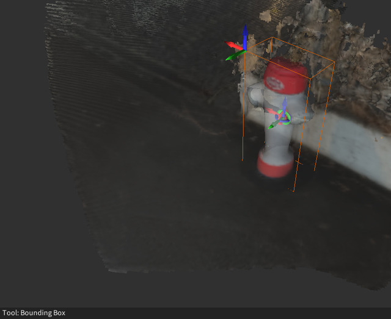

# 3D Data Annotation Tool

This project is a graphical user interface for annotating point clouds and [Stray scenes](https://docs.strayrobots.io/formats/data.html).

Several different label types are supported, including:
- Bounding boxes
- Keypoints
- Rectangles

### Bounding Box Labels



An example of a bounding box is shown above. They have the following properties:
- `class_id` the class id of the label.
- `position` the x, y, z position relative to the point cloud.
- `orientation` the rotation that transforms vectors in the box coordinate frame to the point cloud coordinate frame.
- `dimensions` three values denoting the width along the x, y and z axes in the bounding boxes local coordinate frame.

### Keypoint Labels


Keypoints are individual points in the global coordinate frame. They have the following properties:
- `class_id` the class id of the label.
- `position` the x, y, z position in the global frame.

### Rectangle Labels


Rectangles, show above, are rectangular planes that have a size (height and width), an orientation and position.

The properties are:
- `class_id` the class id of the label.
- `position` the x, y, z position of the center in the global frame.
- `orientation` the rotation taking vectors in local frame to the world frame.
- `size` width and height of the rectangle.

## Usage

The keyboard shortcuts are:
- `ctrl+s` to save the annotations.
- `k` switches to the keypoint tool.
- `b` switches to the bounding box tool.
- `r` switches to the rectangle tool.
- `v` switches to the move tool.

## Installation

System package dependecies are:
- glfw3
- eigen3
- OpenMP

On Ubuntu these can be installed with `sudo apt-get install libeigen3-dev libglfw3-dev libomp-dev libxinerama-dev libxcursor-dev libxi-dev`.

Initialize submodules with `git submodule update --init --recursive`. Initialize git large file storage using `git lfs install`.

Create build folder `mkdir -p build && cd build`. Build and run with `cmake .. -DCMAKE_BUILD_TYPE=Release && make -j4 main && ./main`.

## Usage

TODO: point cloud tool usage

Run `./main <dataset-folder>`. The dataset folder is the one containing a `scene/` subdirectory. The `scene/` subdirectory in turn should contain an `integrated.ply` mesh file created by the reconstruction system.

Keypoints are saved at `<dataset-folder>/keypoints.json` as a list of objects with attributes `x`, `y` and `z` which correspond to coordinates in the local coordinate system of the `integrated.ply` mesh.


## Running tests

In your build directory, run:
```
cmake .. &&
make build_tests &&  # or ninja build_tests if using ninja.
ctest
```

## Code formatting

Code can be formatted using clang-format.

Install clang-format on Mac (brew):

`brew install clang-format`

Install clang-format on Ubuntu:

`sudo apt install clang-format`

 There's a script that runs formatting on all .h and .cc files based on the .clang-format file. Usage: `./run_formatting`

## Deploying

To deploy package the package, first install `s3cmd` with `brew install s3cmd` or `sudo apt-get install s3cmd`. Then follow the instructions [here](https://docs.digitalocean.com/products/spaces/resources/s3cmd/) to configure it to with your access key to access the stray-build bucket.

Deploy by running the script `./deploy.sh`. It will build the project from scratch and upload the binary to Digital Ocean for the current platform and machine architecture.


